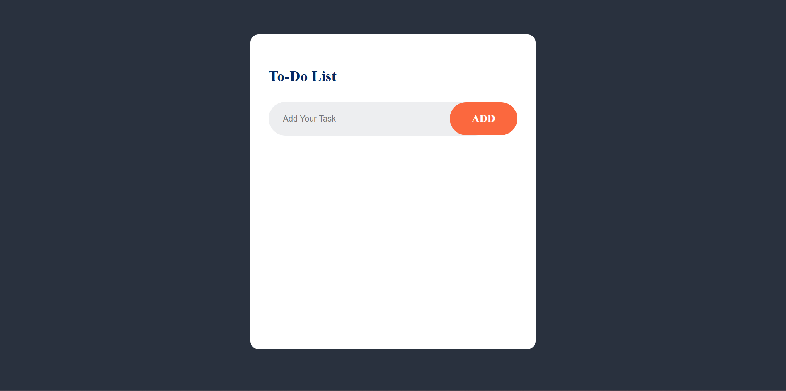

# To-Do Application

A simple and intuitive To-Do application built with **React.js** for task management. This project demonstrates the use of React state management, dynamic UI updates, and responsive design to create a user-friendly experience.



---

## 🚀 Features
- **Task Management**: Add, edit, and delete tasks with ease.
- **Dynamic State Updates**: Changes reflect instantly with React's state management.
- **Clean UI**: Simple and distraction-free interface for easy task tracking.

---

## 🛠️ Tech Stack
- **Front-End**: React.js, HTML, CSS

---

## 📂 Project Structure
```
root
├── public/
├── src/
│   ├── components/
│   ├── styles/
│   └── App.js
├── .gitignore
├── package.json
└── README.md
```

---

## 🚀 Getting Started

### Prerequisites
Ensure you have the following installed:
- **Node.js** (v14 or later)
- **npm** or **yarn** package manager

### Installation
1. Clone the repository:
   ```bash
   git clone https://github.com/TylerJarvis3256/ToDoApp.git
   cd ToDoApp
   ```

2. Install dependencies:
   ```bash
   npm install
   ```

3. Start the development server:
   ```bash
   npm start
   ```

4. Open your browser and navigate to:
   ```
   http://localhost:3000
   ```

---

## 🌟 Demo
[Demo Link](https://my-todoapp-demo.netlify.app/)

---

## 📝 To-Do
- [ ] Add task prioritization (e.g., high, medium, low).
- [ ] Implement due date reminders.
- [ ] Make responsive for mobile friendliness.

---

## 💬 Contact
- **Author**: Tyler Jarvis
- **Email**: tylerjarvis3256@gmail.com
- **LinkedIn**: [Tyler Jarvis LinkedIn](https://linkedin.com/in/tyler-jarvis-b8a72023b)
- **GitHub**: [Tyler Jarvis GitHub](https://github.com/TylerJarvis3256)
